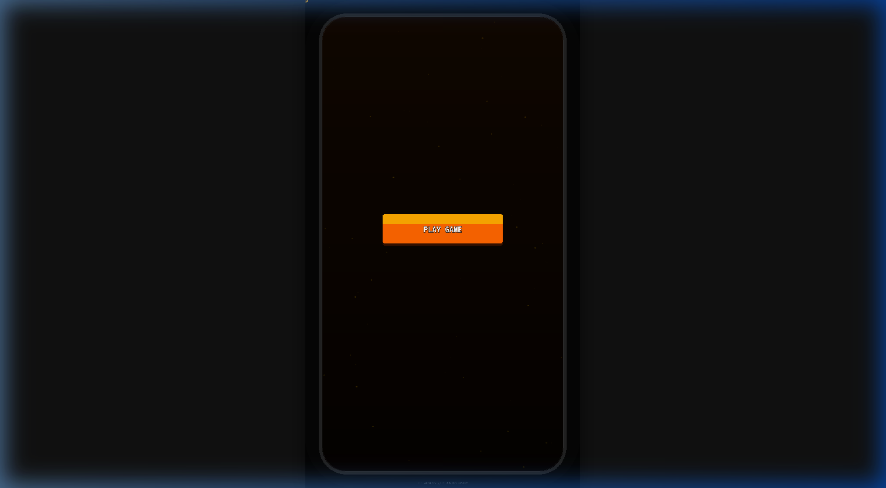
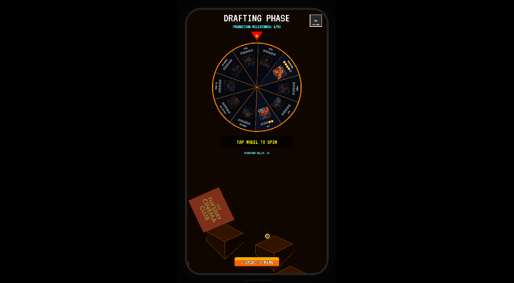
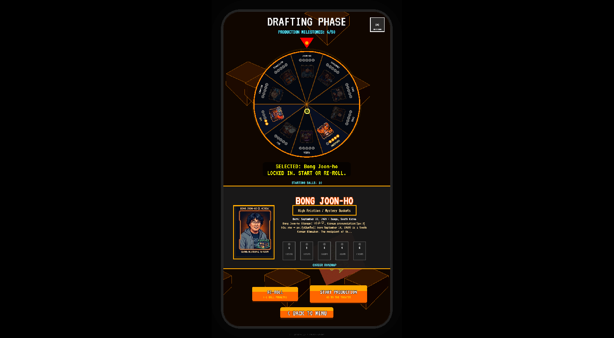

# Grounded Play: Plopkino

A cinematic pachinko roguelite built with Phaser 3 and Vite.



## 🎬 Overview

Experience a unique blend of arcade pachinko mechanics and cinematic storytelling. Select your directors, manage your balls, and navigate through a series of cinematic challenges.

### 🎡 Director Drafting


### 📂 Archive & Dossier


## 🛠️ Setup & Development

### Prerequisites

- [Node.js](https://nodejs.org/) (v18+ recommended)
- [npm](https://www.npmjs.com/)

### Installation

1. Clone the repository:
   ```bash
   git clone https://github.com/tuesday-cinema-club/grounded-play.git
   cd grounded-play
   ```

2. Install dependencies:
   ```bash
   npm install
   ```

### Running Locally

To start the development server with Hot Module Replacement (HMR):

```bash
npm run dev
```

The game will be available at `http://localhost:5173`.

### Building for Production

To create a production-ready bundle in the `dist` folder:

```bash
npm run build
```

---

## 📝 TODO List

### Features & Gameplay
- [ ] **Director Campaign Progression**: Implement a persistent campaign map and progression system.
- [ ] **Trait Synergy**: Add complex synergies between different director traits.
- [ ] **Risk-Reward Re-Roll**: Polish the ball-cost mechanic for re-rolling directors.
- [ ] **Advanced Physics**: Fine-tune the spinning gear interactions in the Pachinko scene.

### UI & UX
- [ ] **Mobile Optimization**: Ensure full responsiveness for various mobile screen sizes.
- [ ] **Enhanced Sidebar**: Add more detailed director biographies and real-time stats.
- [ ] **Victory/Defeat Screens**: Create high-fidelity animations for game outcomes.

### Technical & Polish
- [ ] **Audio Engine**: Finalize the centralized BackgroundScene for seamless music transitions.
- [ ] **Asset Management**: Optimize spritesheets for faster load times.
- [ ] **Bug Squashing**: Address minor WebGL rendering artifacts in the sidebar.

---

## 🚀 Branching Strategy

The main development branch is named `mother`. Please ensure all pull requests are targeted towards `mother`.
