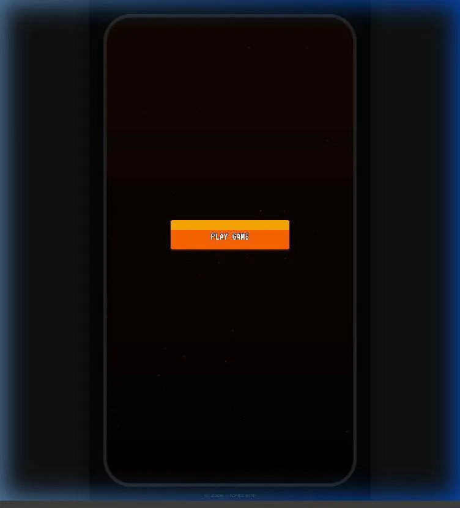

<p align="center">
  
</p>

# 🎞️ pa-kino <sup>SUPER</sup>

### *Lights. Camera. Gravity.*

[**🕹️ Play Now on Itch.io**](https://tuesdaycinemaclub.itch.io/pa-kino-super)

[](https://phaser.io/)
[](https://vitejs.dev/)
[](#roadmap)
[](LICENSE)

**pa-kino <sup>SUPER</sup>** is a high-stakes **Cinematic Pachinko Roguelite** built for the bold. Manage your film budget, draft legendary directors, and master the physics of the "Oscar" pegs in a quest for cinematic immortality.

---

## 📽️ The Concept

In the world of *pa-kino <sup>SUPER</sup>*, every drop is a scene, and every bounce is a plot twist. You are the Producer. Your goal is to navigate the chaotic development of a film by dropping reels into a custom-tuned physics engine where high-risk maneuvers lead to high-rating rewards.

### 🌟 Core Pillars

- **🎡 Director Drafting**: Start every run by selecting from a pool of visionary directors. Each comes with a unique **Trait** (e.g., *Explosive Action*, *Slow-Burn Drama*) that fundamentally alters how balls interact with the board.
- **🎞️ Production Management**: Balance your **Budget** and **Reel Count**. Run out of reels, and your production is "In the Can" (Game Over).
- **🏆 Cinematic Score**: Hit the elusive **10.0 Rating** by mastering precise drops, triggering multi-ball "Awards Seasons," and navigating the treacherous "Director's Wheel."

---

## 📸 Visual Showcase

| Director Drafting | Pachinko Physics |
| :---: | :---: |
|  |  |
| *Real-time Director Selection* | *High-stakes Multiball Action* |

---

## 🛠️ Technical Stack

Built with modern web technologies for maximum performance and buttery-smooth 60FPS physics:

- **Engine**: [Phaser 3](https://phaser.io/) (WebGL Rendering)
- **Physics**: [Matter.js](https://brm.io/matter-js/) (Custom Arcade Physics Tuning)
- **Tooling**: [Vite](https://vitejs.dev/) for lightning-fast HMR
- **UI System**: Custom reactive UI layer built for arcade-style cabinet layouts

---

## 🚀 Getting Started

### Prerequisites

- **Node.js** (v18.0.0+)
- **npm** (v9.0.0+)

### Quick Start

1. **Clone the Set**:
   ```bash
   git clone https://github.com/tuesday-cinema-club/grounded-play.git
   cd grounded-play
   ```

2. **Install the Crew**:
   ```bash
   npm install
   ```

3. **Call "Action!"**:
   ```bash
   npm run dev
   ```
   Open [http://localhost:5173](http://localhost:5173) to start playing.

---

## 🗺️ Roadmap

### 🏁 Milestone 1: Production Fundamentals (In Progress)
- [x] **Director Select Logic**: Dynamic wheel selection system.
- [x] **Cabinet UI**: 70/30 sidebar layout for stats and bios.
- [x] **Core Physics**: Custom peg collisions and multi-ball triggers.
- [/] **Scanline Polish**: Hardware-accelerated CRT effects.

### 🎞️ Milestone 2: The Campaign Update
- [ ] **Persistent Progression**: A map-based "Awards Season" campaign.
- [ ] **Advanced Synergies**: Combo systems between Director Traits and Studio Upgrades.
- [ ] **The Shop**: Detailed mid-run upgrades for ball weight, gravity, and luck.

### 🍿 Milestone 3: Post-Production & Polish
- [ ] **Mobile Mastery**: Full touch-optimized interaction model.
- [ ] **Audio Engine 2.0**: Context-aware cinematic scoring that reacts to gameplay.
- [ ] **Localization**: Subtitles and bios in 5+ languages.

---

## 🤝 Contributing

We are currently in **Active Alpha**. 

- **Main Branch**: All PRs should target the `mother` branch.
- **Reporting Bugs**: Please use the GitHub Issues tab with the "Production Error" label.

---

<p align="center">
  Tuesday Cinema Club games presenting some code from Grounded Play by Government Name ❤️
</p>
